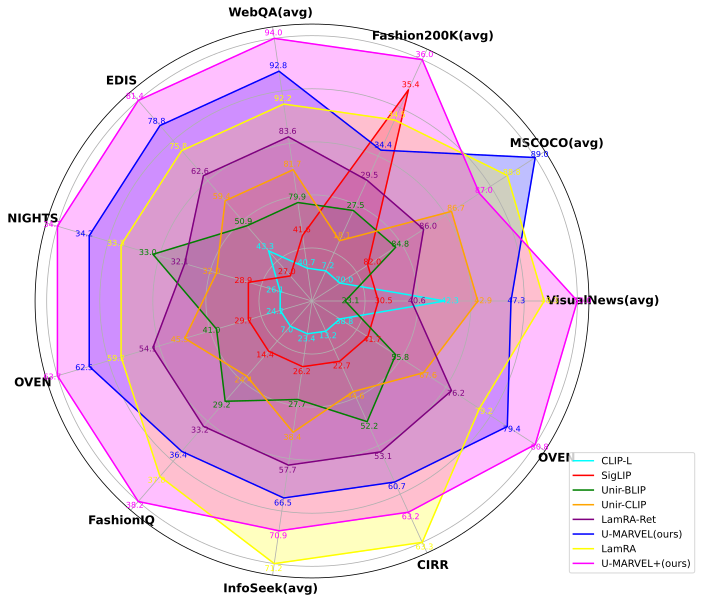
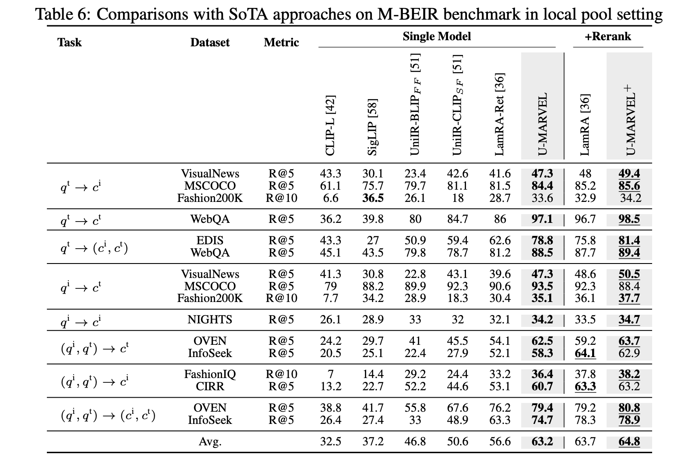
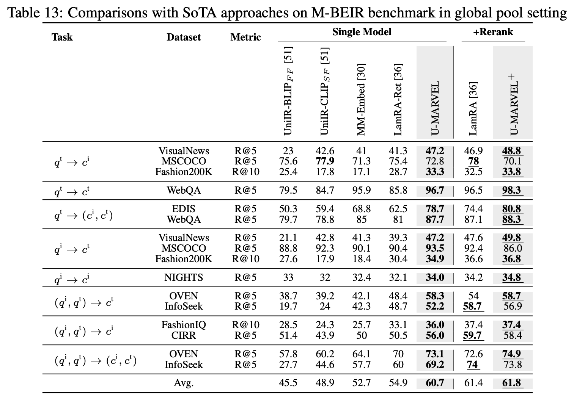
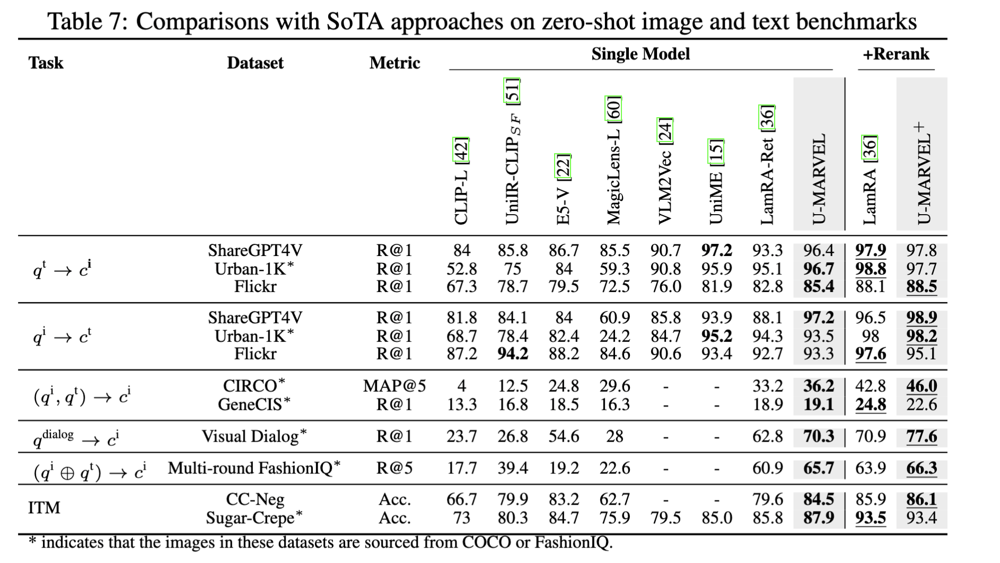
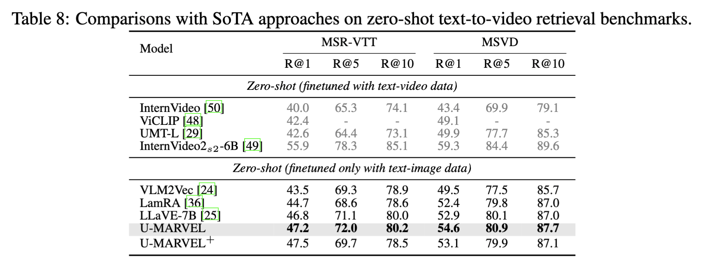

## U-MARVEL: Unveiling Key Factors for Universal Multimodal Retrieval via Embedding

Universal multimodal retrieval (UMR) addresses complex retrieval tasks involving diverse modalities for both queries and candidates. Despite the success of state-of-the-art methods based on multimodal large language models (MLLMs) using contrastive learning principles, the mechanisms underlying their retrieval capabilities remain largely unexplored. This gap potentially leads to suboptimal performance and limited generalization ability.

In this study, we systematically analyze the key factors driving effective embedding learning for UMR using MLLMs. We implement a general MLLM-based embedding learning pipeline and investigate contributors to high-performing universal retrieval systems. Our analysis covers various aspects of embedding generation and training strategies, including progressive transition, hard negative mining, and re-ranker distillation. Our findings reveal that often-overlooked factors can significantly impact model performance.

Building on these insights, we introduce U-MARVEL (Universal Multimodal Retrieval via Embedding Learning), a unified framework that outperforms state-of-the-art competitors on the M-BEIR benchmark in supervised settings and demonstrates strong zero-shot performance on tasks such as composed image retrieval and text-to-video retrieval. These results highlight the generalization potential of our framework across various embedding-based retrieval tasks, providing valuable insights for future research.


<div align="center">
  
</div>


## Model Checkpoints

```
├── checkpoints
│   ├── hf_models
│   │   └── Qwen2-VL-7B-Instruct
│   └── U-MARVEL-Qwen2VL-7B-Instruct
```

- [U-MARVEL-Qwen2VL-7B-Instruct](https://huggingface.co/TencentBAC/U-MARVEL-Qwen2VL-7B-Instruct) 🤗
- [Qwen2-VL-7B-Instruct](https://huggingface.co/Qwen/Qwen2-VL-7B-Instruct)
- Inference code available at: [U-MARVEL-inference](https://github.com/chaxjli/U-MARVEL)
## Requirements

To install requirements:

```setup
pip install -r requirements.txt
```

### Data Preparation

Download Qwen2-VL-7B and place it in `./checkpoints/hf_models/Qwen2-VL-7B-Instruct`

For NLI dataset, please refer to [link](https://huggingface.co/datasets/princeton-nlp/datasets-for-simcse)

For multimodal instruction tuning datset, please refer to [M-BEIR](https://huggingface.co/datasets/TIGER-Lab/M-BEIR)

After downloading all of them, organize the data as follows in `./data`

```
├── data    
│    ├── M-BEIR
│    ├── nli_for_simcse.csv
│    ├── rerank_data_for_training
│    ├── flickr
│    ├── coco
│    ├── sharegpt4v
│    ├── Urban1K
│    ├── circo
│    ├── genecis
│    ├── vist
│    ├── visdial
│    ├── ccneg
│    ├── sugar-crepe
│    ├── MSVD
│    └── msrvtt
```

## Evaluation

To evaluate our model on M-BEIR, run:

```bash
python scripts/vtools_eval_mbeir_model.py  # Evaluate locally  
sh scripts/eval_mbeir_global.sh            # Evaluate globally  
sh scripts/eval_zeroshot.sh                # Evaluate zero-shot
```

## Model Performance

The proposed U-MARVEL framework establishes new state-of-the-art performance across both
single-model architectures and recall-then-rerank approaches on M-BEIR benchmark.

<div align="center">

</div>

<div align="center">

</div>

<div align="center">

</div>

<div align="center">

</div>


## Acknowledgements

Many thanks to the code bases from **[lamra](https://github.com/Code-kunkun/LamRA)** .
