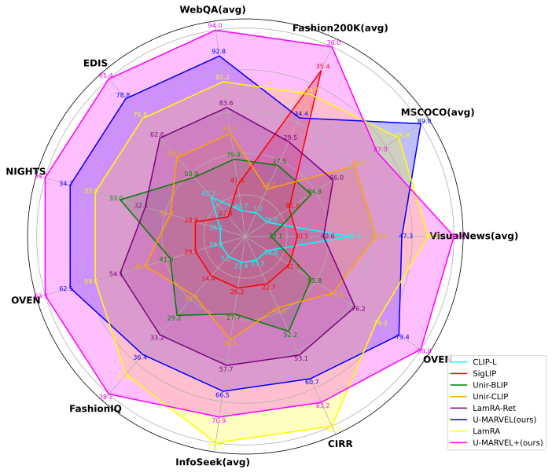
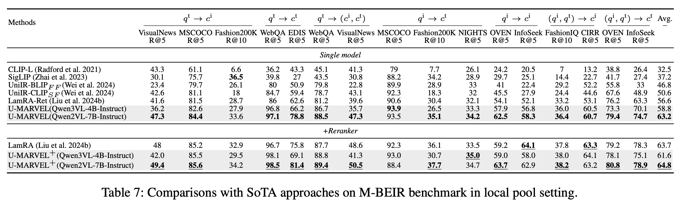
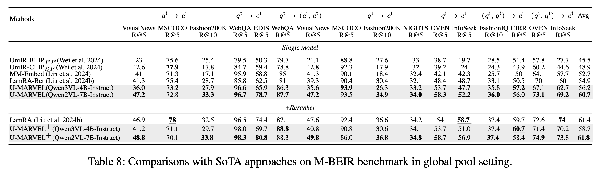
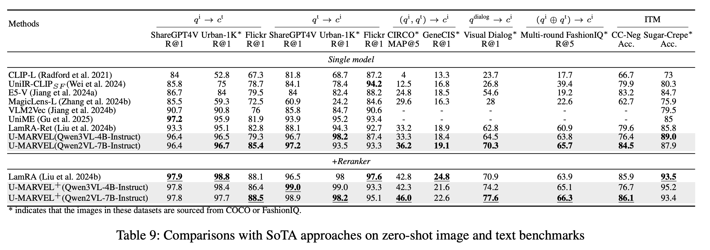
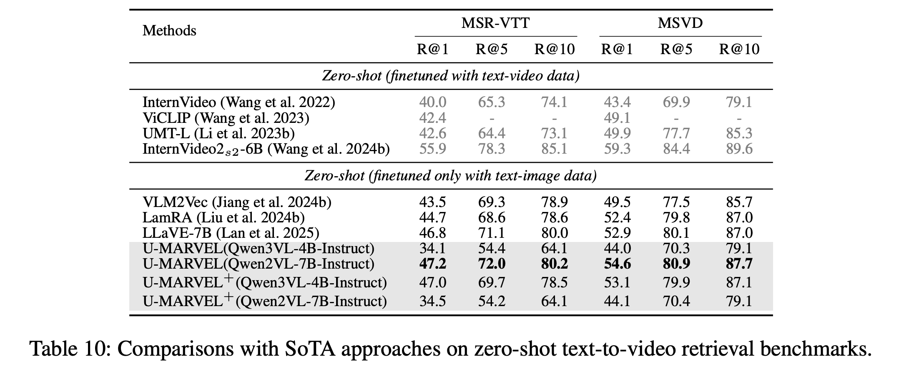

## U-MARVEL: Unveiling Key Factors for Universal Multimodal Retrieval via Embedding Learning with MLLMs

Universal multimodal retrieval (UMR) addresses complex retrieval tasks involving diverse modalities for both queries and candidates. Despite the success of state-of-the-art methods based on multimodal large language models (MLLMs) using contrastive learning principles, the mechanisms underlying their retrieval capabilities remain largely unexplored. This gap potentially leads to suboptimal performance and limited generalization ability.

In this study, we systematically analyze the key factors driving effective embedding learning for UMR using MLLMs. We implement a general MLLM-based embedding learning pipeline and investigate contributors to high-performing universal retrieval systems. Our analysis covers various aspects of embedding generation and training strategies, including progressive transition, hard negative mining, and re-ranker distillation. Our findings reveal that often-overlooked factors can significantly impact model performance.

Building on these insights, we introduce U-MARVEL (Universal Multimodal Retrieval via Embedding Learning), a unified framework that outperforms state-of-the-art competitors on the M-BEIR benchmark in supervised settings and demonstrates strong zero-shot performance on tasks such as composed image retrieval and text-to-video retrieval. These results highlight the generalization potential of our framework across various embedding-based retrieval tasks, providing valuable insights for future research.


<div align="center">
  
</div>


## Model Checkpoints

```
├── checkpoints
│   ├── hf_models
│   │   └── Qwen2-VL-7B-Instruct
│   │   └── Qwen3-VL-4B-Instruct
│   └── U-MARVEL-Qwen2VL-7B-Instruct
│   └── U-MARVEL-Qwen3VL-4B-Instruct
```

- [U-MARVEL-Qwen2VL-7B-Instruct](https://huggingface.co/TencentBAC/U-MARVEL-Qwen2VL-7B-Instruct) 🤗
- [U-MARVEL-Qwen3VL-4B-Instruct](https://huggingface.co/TencentBAC/U-MARVEL-Qwen3VL-4B-Instruct) 🤗

## Requirements

To install requirements:

```setup
pip install -r requirements_qwen2_vl.txt
```

## Training

To train the model(s) in the paper, run this command: Shown here is the configuration for Qwen2-VL-7B. The training scripts for Qwen3-VL-4B and Qwen3-VL-8B are analogous and require similar modifications.

### 1. Data Preparation

Download Qwen2-VL-7B and place it in `./checkpoints/hf_models/Qwen2-VL-7B-Instruct`

For NLI dataset, please refer to [link](https://huggingface.co/datasets/princeton-nlp/datasets-for-simcse)

For multimodal instruction tuning datset, please refer to [M-BEIR](https://huggingface.co/datasets/TIGER-Lab/M-BEIR)

After downloading all of them, organize the data as follows in `./data`

```
├── M-BEIR
├── nli_for_simcse.csv
├── rerank_data_for_training
├── flickr
├── coco
├── sharegpt4v
├── Urban1K
├── circo
├── genecis
├── vist
├── visdial
├── ccneg
├── sugar-crepe
├── MSVD
└── msrvtt
```

```train
get_10percent_training_data.ipynb
get_training_data_local_format.ipynb
```

> Run the `get_10percent_training_data.ipynb` notebook to extract 10% of the query data from the training set for subsequent distillation.
>
> Run the `get_training_data_local_format.ipynb` notebook to partition the M-BEIR dataset's queries and candidates into 16 tasks, which will be used for subsequent hard negative mining.

### 2. U-MARVEL

#### 2.1 Progressive transition

**Fine-tuning with NLI dataset**

```bash
python scripts/umarvel/nli/vtools_umarvel_progressive_transition_nli.py
sh scripts/merge_lora.sh
```

> To fine-tune the model using the CC3M dataset, we executed the `scripts/umarvel/nli/vtools_umarvel_progressive_transition_nli.py` script , resulting in the model named `qwen2-vl-7b_umarvel_progressive_transition_nli`. Subsequently, we adjusted the parameters and merged the LoRA with the base model by running the `merge_lora.sh` script.

**Fine-tuning with CC3M dataset**

```bash
python scripts/umarvel/cc3m_sharegpt4v_laion/vtools_finetune_cc3m_llm.py
sh scripts/merge_lora.sh
```

> To fine-tune the model using the CC3M dataset, we executed the `scripts/umarvel/cc3m/vtools_finetune_qwen2-vl-7b_umarvel_progressive_transition_cc3m.py` script. This resulted in the model named `qwen2-vl-7b_umarvel_progressive_transition_cc3m`. Subsequently, we adjusted the parameters and merged the LoRA with the base model by running the `merge_lora.sh` script.

**Fine-tuning with M-BEIR dataset**

```bash
python scripts/umarvel/mbeir/vtools_finetune_qwen2-vl-7b_umarvel_progressive_transition_m-beir.py
sh scripts/merge_lora.sh
```

> To fine-tune the model using the M-BEIR dataset, we executed the `scripts/umarvel/mbeir/vtools_finetune_qwen2-vl-7b_umarvel_progressive_transition_m-beir.py` script. This resulted in the model named `qwen2-vl-7b_umarvel_progressive_transition_m-beir`. Subsequently, we adjusted the parameters and merged the LoRA with the base model by running the `merge_lora.sh` script.

---

#### 2.2 Hard Negative Mining

**Get training data (full set) with local type negative samples for training point-wise model**

```bash
python scripts/umarvel_rank/vtools_get_train_data_from_eval_train_data_local.py
python scripts/umarvel_rank/vtools_merge_train_data_from_eval_train_local.py
```

**Get training data (full set) with global type negative samples for train hard negative mining model**

```bash
sh scripts/umarvel_rank/get_train_data_from_eval_train_data_global.sh
python scripts/umarvel_rank/vtools_merge_train_data_from_eval_train_global.py
```

**Fine-tuning with hard negative mining**

```bash
python scripts/umarvel/mbeir/vtools_finetune_qwen2-vl-7b_umarvel_hard_negative_mining.py  
sh scripts/merge_lora.sh  
```

#### 2.3 Distillation

**Train point-wise rerank model**

```bash
python scripts/umarvel_rank/vtools_train_rerank_multi_nodes_only_pointwise.py
```

**Get top-100 negative samples for queries (local and global versions)**  

```bash
# Get top 100 negative samples (local version)
python scripts/umarvel_rank/vtools_get_train_data_from_eval_train_10percent_data_local.py
# Merge training data (local version)
python scripts/umarvel_rank/vtools_merge_train_data_from_eval_train_local_10percent.py

# Get top 100 negative samples (global version)
sh scripts/umarvel_rank/get_train_data_from_eval_train_10percent_data_global.sh
# Merge training data (global version)
python scripts/umarvel_rank/vtools_merge_train_data_from_eval_train_global_10percent.py  
```

**Process using the rerank model to obtain point-wise scores**  

```bash
# Process local version to obtain point-wise scores
python scripts/eval/rerank/vtools_eval_train_data_rerank_mbeir_pointwise_local_10percent.py
# Process global version to obtain point-wise scores
python scripts/eval/rerank/vtools_eval_train_data_rerank_mbeir_pointwise_global_10perncent.py
```

**Obtain distillation scores**  

```bash
python scripts/eval/rerank/get_mbeir_base_rerank_pointwise_score_local.py
python scripts/eval/rerank/get_mbeir_base_rerank_pointwise_score_global.py
python scripts/umarvel/mbeir/vtools_finetune_qwen2-vl-7b_umarvel_distillation.py
```

**Compare distilled model with negative sample model**  

```bash
python scripts/umarvel/mbeir/vtools_finetune_qwen2-vl-7b_umarvel_hard_negative_mining-continue_hard.py  # Compare distilled model with negative sample model
```

> The script `python scripts/umarvel/mbeir/vtools_finetune_qwen2-vl-7b_umarvel_hard_negative_mining-continue_hard.py` is used to compare the performance of a distilled model with that of a model trained using hard negative samples.

### 3. U-MARVEL+

To obtain the rerank+ model, execute the following commands:

```bash
python scripts/umarvel_rank/u-marvel+/vtools_get_train_data_from_eval_train_data_local-umarvel+.py
python scripts/umarvel_rank/u-marvel+/vtools_merge_train_data_from_eval_train_local_umarvel+.py
python scripts/umarvel_rank/u-marvel+/vtools_train_rerank_multi_nodes_only_pointwise-umarvel+.py
```

## Evaluation

To evaluate our model on M-BEIR, run:

### 1.  U-MARVEL

**Evaluate models at each stage**  

```bash
python scripts/eval/fast_eval/vtools_eval_mbeir_local_fast_qwen2-vl-7b_umarvel_progressive_transition_m-beir.py 
python scripts/eval/fast_eval/vtools_eval_mbeir_local_fast_qwen2-vl-7b_umarvel_hard_negative_mining.py 
python scripts/eval/fast_eval/vtools_eval_mbeir_local_fast_qwen2-vl-7b_umarvel_distillation.py
python scripts/eval/fast_eval/vtools_eval_mbeir_local_fast_qwen2-vl-7b_umarvel_hard_negative_mining-continue_hard.py
sh scripts/eval/bash/eval_mbeir_global.sh
```

**Zero-shot evaluation**  

```bash
python scripts/eval/bash/vtools_eval_zero-shot.py
```

### 2.  U-MARVEL+

**Evaluate rerank (local version)**  

```bash
python scripts/eval/rerank/umarvel+/vtools_eval_rerank_mbeir_pointwise_local_umarvel+.py
python eval/rerank/mbeir_rerank_pointwise_local_for_weight.py 
```

---

**Evaluate rerank (global version)**  

```bash
python scripts/eval/rerank/umarvel+/vtools_eval_rerank_mbeir_pointwise_global_umarvel+.py
python scripts/umarvel_rank/u-marvel+/vtools_train_rerank_multi_nodes_only_pointwise-umarvel+.py
```

---

**Zero-shot evaluation for umarvel+ model**  

```bash
sh scripts/eval/bash/eval_rerank_zeroshot.sh
python scripts/eval/bash/get_rerank_results_zeroshot.sh
```

## Model Performance

The proposed U-MARVEL framework establishes new state-of-the-art performance across both
single-model architectures and recall-then-rerank approaches on M-BEIR benchmark.

<div align="center">

</div>

<div align="center">

</div>

<div align="center">

</div>

<div align="center">

</div>


## Acknowledgements

Many thanks to the code bases from **[LamRA](https://github.com/Code-kunkun/LamRA)** .

## Citation
If you use this code for your research or project, please cite:
```latex
@inproceedings{li2026umarvel,
title={U-{MARVEL}: Unveiling Key Factors for Universal Multimodal Retrieval via Embedding Learning with {MLLM}s},
author={Xiaojie Li and Chu Li and Shi-Zhe Chen and Xi Chen},
booktitle={The Fourteenth International Conference on Learning Representations},
year={2026}
}
```